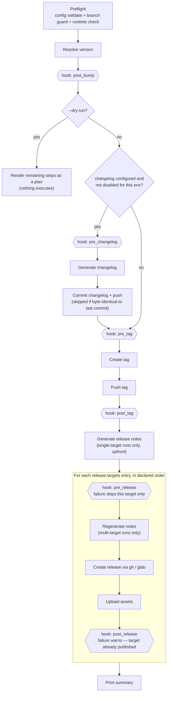
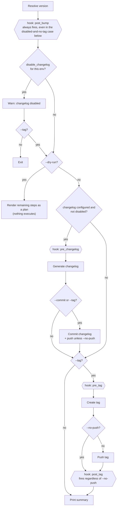

# Guide: Release pipeline and hook positions

[Spec 02 § `hooks`](../specs/02-configuration.md#hooks) documents each of the six hook
points in isolation — when it fires, what template variables it sees, how failures are
handled. This guide instead shows the two pipelines end to end, so it's visible at a
glance where each hook point actually sits relative to every other step. It does not
replace Spec 02 or [ADR-0053](../adr/0053-release-lifecycle-hooks.md) as the source of
truth for hook behavior — treat this page as a map, those as the reference.

Hook nodes are drawn as hexagons in both diagrams below.

## `heraut release`

Things the diagram compresses that are worth stating explicitly:

- **`post_bump` fires unconditionally**, before the `--dry-run` check — it runs (or, under
  `--dry-run`, renders) even on a run that will otherwise change nothing, e.g.
  `disable_changelog: true` with no other flags.
- **`pre_tag` fires whichever branch the changelog decision took.** A skipped or disabled
  changelog step doesn't skip `pre_tag` — it's a separate gate, not chained to changelog
  generation.
- **`pre_release`/`post_release` are the one exception to "a failing hook aborts the run."**
  They're scoped per `release.targets` entry: a failing hook skips (`pre_release`) or warns
  (`post_release`) for that target only, and the loop still attempts the rest. A real
  publish failure (not a hook) still aborts the whole loop as every other step does. See
  [Spec 02 § Failure semantics](../specs/02-configuration.md#failure-semantics) for the
  full rationale.
- **`--dry-run` never executes a hook.** Every hook node above still "fires" during a
  dry run, but only to render the substituted command as a plan line — the shell it would
  otherwise run through ([ADR-0054](../adr/0054-windows-hook-execution.md)) never starts.

## `heraut changelog`

`pre_release`/`post_release` never appear here — `heraut changelog` never publishes to a
platform, so those two points simply don't exist in this pipeline (no flag needed to turn
them off). Note also that `--tag` with `disable_changelog: true` skips straight from the
disabled-changelog warning to the tag section: `pre_changelog` and `post_bump`'s sibling
changelog-generation step never run, but `pre_tag`/`post_tag` still do — see [Spec 03 §
Tag-only workflow](../specs/03-commands.md#tag-only-workflow-no-release-block-required).

## Hook point quick reference

| Point            | Fires (both pipelines, unless noted)                          |
|-------------------|----------------------------------------------------------------|
| `post_bump`       | Immediately after version resolution — unconditionally.        |
| `pre_changelog`   | Before changelog generation — only when a changelog actually generates this run. |
| `pre_tag`         | Before the local git tag is created — only when a tag is actually created this run. |
| `post_tag`        | After the tag push attempt — fires even with `--no-push`.       |
| `pre_release`     | `heraut release` only, once per `release.targets` entry, before publishing. |
| `post_release`    | `heraut release` only, once per `release.targets` entry, after publishing (and any asset upload). |

Full detail — command list semantics, template variables (`{{ .Version }}`, `{{ .Tag }}`,
`{{ .PreviousTag }}`, `{{ .Platform }}`), failure semantics, and `--no-hooks` — lives in
[Spec 02 § `hooks`](../specs/02-configuration.md#hooks).

## See also

- [ADR-0053: Release lifecycle hooks](../adr/0053-release-lifecycle-hooks.md) — why hooks
  are shaped this way, including the `pre_release`/`post_release` isolation decision.
- [Spec 02 § `hooks`](../specs/02-configuration.md#hooks) — configuration reference.
- [Spec 03 § `heraut release`](../specs/03-commands.md#heraut-release) and
  [§ `heraut changelog`](../specs/03-commands.md#heraut-changelog) — full command/flag
  reference, including the non-hook action sequence this guide diagrams.
